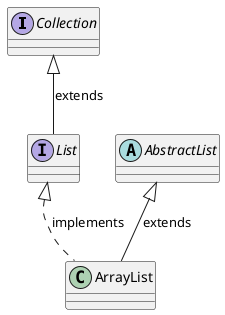
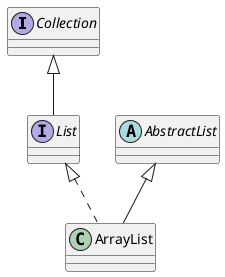

[UP](/uml.html)

{:refdef: style="text-align: center;"}

{:refdef}

## 第一种方式

```plantuml
@startuml
interface Collection
interface List
abstract class AbstractList
class ArrayList

Collection <|-- List: extends
List <|.. ArrayList: implements
AbstractList <|-- ArrayList: extends
@enduml
```

{:refdef: style="text-align: center;"}

{:refdef}

## 第二种方式

```plantuml
@startuml
interface Collection
interface List extends Collection

abstract class AbstractList
class ArrayList extends AbstractList implements List
@enduml
```

{:refdef: style="text-align: center;"}

{:refdef}
