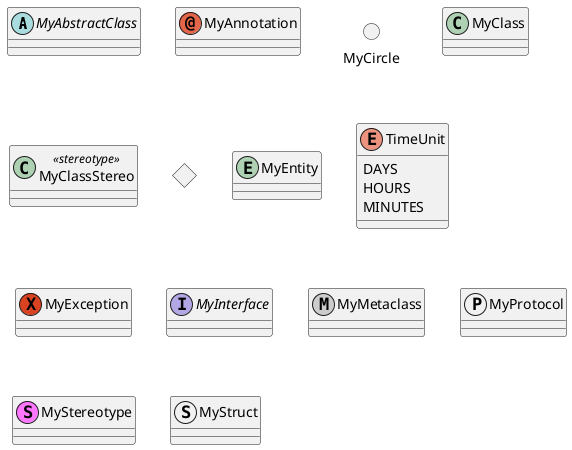
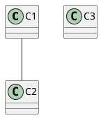
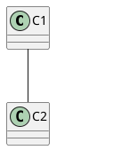
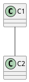

```plantuml
@startuml

class Foo1
class Foo2

Foo2 *-- Foo1

remove Foo2

@enduml
```

[UP](/uml.html)

## Basic

{:refdef: style="text-align: center;"}

{:refdef}

## Hide Classes

You can also use the `show/hide` commands to hide classes.

This may be useful if you define a large [!included file],
and if you want to hide some classes after [file inclusion].

{:refdef: style="text-align: center;"}

{:refdef}

## Remove classes

You can also use the `remove` commands to remove classes.

This may be useful if you define a large [!included file],
and if you want to hide some classes after [file inclusion].

{:refdef: style="text-align: center;"}

{:refdef}

## Hide or Remove unlinked class

{:refdef: style="text-align: center;"}

{:refdef}

{:refdef: style="text-align: center;"}

{:refdef}

{:refdef: style="text-align: center;"}

{:refdef}

## Reference

- [Class Diagram](https://plantuml.com/class-diagram)
