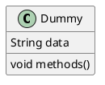
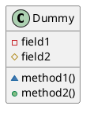
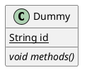
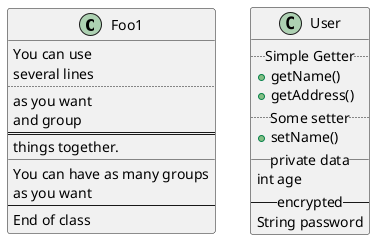
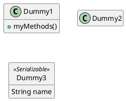

[UP](/uml.html)

## 成员

{:refdef: style="text-align: center;"}

{:refdef}

## 可见性

| Character | Icon for field                                                 | Icon for method                                                 | Visibility        |
|-----------|----------------------------------------------------------------|-----------------------------------------------------------------|-------------------|
| `-`       |          |          | `private`         |
| `#`       |        |        | `protected`       |
| `~`       |  |  | `package private` |
| `+`       |           |           | `public`          |

{:refdef: style="text-align: center;"}

{:refdef}

## Abstract and Static

You can define static or abstract methods or fields using the `{static}` or `{abstract}` modifier.

{:refdef: style="text-align: center;"}

{:refdef}

## Advanced class body

By default, methods and fields are automatically regrouped by PlantUML.

You can use separators to define your own way of ordering fields and methods.
The following separators are possible:

- `--`
- `..`
- `==`
- `__`

{:refdef: style="text-align: center;"}

{:refdef}

## Hide attributes, methods...

You can parameterize the display of classes using the `hide/show` command.

The basic command is: `hide empty members`. This command will hide attributes or methods if they are empty.

Instead of empty members, you can use:

- `empty fields` or `empty attributes` for empty fields,
- `empty methods` for empty methods,
- `fields` or `attributes` which will hide fields, even if they are described,
- `methods` which will hide methods, even if they are described,
- `members` which will hide fields and methods, even if they are described,
- `circle` for the circled character in front of class name,
- `stereotype` for the stereotype.

You can also provide, just after the `hide` or `show` keyword:

- `class` for all classes,
- `interface` for all interfaces,
- `enum` for all enums,
- `<<foo1>>` for classes which are stereotyped with `foo1`,
- an existing class name.

You can use several `show/hide` commands to define rules and exceptions.

{:refdef: style="text-align: center;"}

{:refdef}
