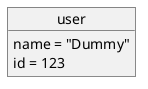
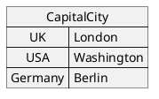
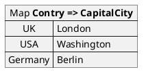
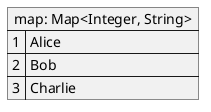
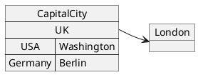
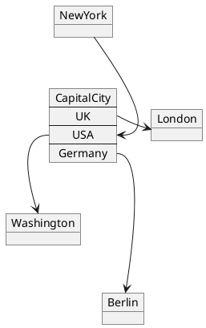
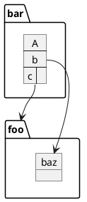
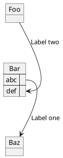

[UP](/uml.html)

## Basic

{:refdef: style="text-align: center;"}

{:refdef}

{:refdef: style="text-align: center;"}

{:refdef}

## Map table

You can define a map table with `map` keyword and `=>` separator.

{:refdef: style="text-align: center;"}

{:refdef}

{:refdef: style="text-align: center;"}

{:refdef}

{:refdef: style="text-align: center;"}

{:refdef}

## Link

{:refdef: style="text-align: center;"}

{:refdef}

{:refdef: style="text-align: center;"}

{:refdef}

{:refdef: style="text-align: center;"}

{:refdef}

{:refdef: style="text-align: center;"}

{:refdef}
